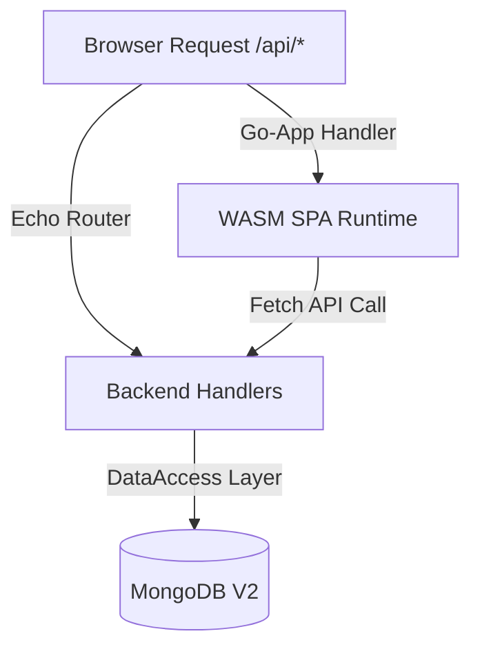

# 🧠 AGENTS.md — Contextual Anchor for AI Developers

This document serves as the high-density **system blueprint**, **architectural anchor**, and **development rulebook** for AI agents (Claude, Gemini, OpenCode, etc.) working on the **Traefik Auth Manager** codebase. Read this file first to understand the system architecture, code conventions, state management, and operational workflows.

---

## 🎯 1. Project Mission
**Traefik Auth Manager** is a lightweight, self-contained application designed to manage credentials, forward authentication authorizations, and secure tokens for Traefik ingress routers. It implements a **dual-build Go architecture** that compiles a single unified codebase into a native Go API backend server and a high-performance, responsive Progressive Web App (PWA) compiled to WebAssembly (WASM).

---

## 🛠️ 2. Tech Stack & Core Dependencies
- **Core Languages & Runtimes**: **Go 1.25.0+** (Dual target: native Go server & Go WebAssembly in the browser).
- **Backend API Framework**: **Echo Framework (v4)** (`github.com/labstack/echo/v4`) for RESTful routing, CORS, and request handling.
- **Frontend PWA Framework**: **go-app (v10)** (`github.com/maxence-charriere/go-app/v10`) for building WebAssembly-based reactive UI components in native Go.
- **UI Styling**: **Bootstrap v5** (loaded via static CSS/JS) for consistent styling, with **Bootstrap Icons** for UI iconography and **Cash.js/Popper.js** for lightweight client-side DOM helpers.
- **Database Engine**: **MongoDB** accessed via the official **MongoDB Go Driver (v2)** (`go.mongodb.org/mongo-driver/v2`).
- **Identity & Authentication**:
  - **OIDC/OAuth2 Protocol**: `github.com/coreos/go-oidc/v3` for token verification and standard OIDC flow handling.
  - **Oauth2 Client**: `golang.org/x/oauth2` integration.
  - **Session Management**: Secure cookie-backed sessions using **Gorilla Sessions** (`github.com/gorilla/sessions`).
- **Configuration Management**: **Viper** (`github.com/spf13/viper`) supporting YAML configurations and prefix-based environment overrides (**`APP_`**).
- **Observability & Tracing**: **OpenTelemetry (OTel)** tracing integrated across Echo routes (via `otelecho` middleware) and MongoDB database drivers (via `otelmongo` monitor), exported via OTLP/gRPC.

---

## 🏗️ 3. Architecture & Design Patterns

### 🔄 The Dual-Build System
The project's architectural core is a single unified directory (`cmd/webapp`) compiled into two separate runtimes depending on compiler environment variables and Go **build tags**:
1. **Frontend (WASM)**: Compiled with `GOOS=js GOARCH=wasm` and the `wasm` build tag.
   - Entry point: `Frontend()` in `cmd/webapp/frontend-entry.go`.
   - Binds reactive UI routes to components defined in `internal/pages`.
2. **Backend (Native)**: Compiled without build tag constraints (`//go:build !wasm`).
   - Entry point: `Backend(ah *app.Handler)` in `cmd/webapp/backend-entry.go`.
   - Starts an Echo server that handles core API routes (`/api/*`, `/login`, `/signout`, etc.) and routes all other requests (`/*`) to the `go-app.Handler` to serve static HTML assets and the WASM binary.



### 🤝 Shared Models & Type Safety
To avoid API contract drift, **models** are written once in `internal/models/` using dual JSON/BSON structural tags. The same Go structs (e.g. `AppUser`, `HostedApplication`) are used on the backend for MongoDB deserialization and on the frontend for state parsing, ensuring complete compile-time type-safety across the network boundary.

### 💾 Encapsulated Data Access Layer
All database interactions are isolated behind specific data access structures inside `internal/db/` (e.g., `AppUserDataAccess`, `HostedApplicationsDataAccess`). Handlers accept a function factory that yields these structs bounded to the request's context (`dbFn func(context.Context) *db.AppUserDataAccess`), ensuring telemetry spans and query timeouts correctly propagate.

### 🌐 Observability & Context-Aware Tracing
- **HTTP Request Tracing**: HTTP boundaries are automatically traced using `otelecho` middleware.
- **Database Query Tracing**: The MongoDB client initializes with an `otelmongo` monitor.
- **Span Propagation**: Explicit tracing spans are started using a helper trace identifier:
  ```go
  ctx, span := packageTracer(ctx).Start(ctx, "db.operation")
  ```

---

## 🗺️ 4. Directory Mental Model

- **`cmd/webapp/`**: System main entry.
  - `main.go`: Central main executor running frontend routines when in browser, or spinning up backend endpoints when run natively.
  - `frontend-entry.go`: Routes PWA paths to UI components (`//go:build wasm`).
  - `backend-entry.go`: Boots the native Echo framework server and handles static assets (`//go:build !wasm`).
  - `app_handler.go`: Declares resources, bootstrap stylesheets, script paths, and service worker parameters.
- **`internal/auth/`**: Core security configurations, redirection scripts, sign-out hooks, and callback authorization logic.
- **`internal/backend/`**: Bootstraps OTel tracer pipelines, implements graceful system teardown listeners, and initializes HTTP routing configuration.
- **`internal/components/`**: Atomic, functional, and reusable PWA UI components (modals, navigators, buttons) built using `go-app` framework structures.
- **`internal/db/`**: Handles database clients, connection health pings, tracing middleware, and specific CRUD repositories.
- **`internal/frontend/`**: Client-side async fetch abstractions, context wrappers (`AppContext`), and state observation mappings.
- **`internal/handlers/`**: Server API route mappings, parameters extraction (`apiParam`), and request validator models.
- **`internal/helpers/`**: Common config parsing utilities (Viper), error boundaries (`AppError`), hashing tools, and log formatting.
- **`internal/models/`**: Unified data entity models shared between native server structures and WASM routines.
- **`internal/pages/`**: Full page-level layout implementations (User, App dashboards, and Home view wrapper).
- **`web/`**: Location of assets (CSS libraries, JS Popper, custom common scripts, service icons) copied during compilation.
- **`scripts/`**: DevOps scripts (e.g. `resize_icons.ps1` for building custom PWA assets).

---

## 📏 5. Development Standards

### 🏷️ Naming Conventions
- **Files**: Use **snake_case** for all package files (e.g., `app_user.go`, `hosted_applications.go`).
- **Structs**: Use **PascalCase** reflecting purpose (e.g., `AppUserDataAccess`, `HostedApplication`).
- **HTTP Route Hooks**: Prefix custom path registers with `Add` and camelCase (e.g., `AddAppUserHandlers`).
- **UI Components**: Use PascalCase for the main component struct (e.g., `CopyValueBtn`) and camelCase helper functions for component parts (e.g., `brandName()`).

### 🚨 Error Handling & Global Logging
- **The Core Wrapper**: All internal handler errors should wrap around `helpers.AppError` using tailored constructors:
  - `helpers.ErrAppBadID(err)`: Returns `http.StatusBadRequest` with a clean error message.
  - `helpers.ErrAppGeneric(err)`: Formats standard `http.StatusInternalServerError` errors safely.
  - `helpers.ErrInvalidData(err)`: Standardizer for bind validation errors.
- **API Results**: Handlers must return failures in a consistent payload wrapper (`models.ApiResult`):
  ```json
  {
    "success": false,
    "errorMessage": "Clean validation message"
  }
  ```
- **Error Boundaries**: The Echo instance binds to `handlers.AppErrorHandler()` which handles serialization of custom `AppError` instances, preventing system details leakage.

### 🔑 Authentication Integration Patterns
- User identification is verified using standard **OIDC ID Tokens** backed by **OAuth2 State/Nonce verification**.
- Sub-API routes are guarded using the `auth.Authenticated()` middleware.
- Only users with email addresses declared within `session.authorized_emails` inside configuration properties are authorized to proceed.

### 💾 Database Conventions (MongoDB Driver V2)
- Explicit timeouts should be declared and honored using `context.WithTimeout` on all queries.
- Data updates must use structural BSON fields:
  ```go
  update := bson.D{{"$set", bson.D{{"applications", u.Applications}}}}
  ```

---

## 🚫 6. Hard Constraints & Anti-Patterns

- ⛔ **NO Go-app Net/HTTP Client inside WASM**: Never use Go's raw `net/http` client in frontend folders (`internal/frontend/` or `internal/pages/`). WebAssembly binaries must utilize `frontend.NewAppContext(ctx)` or the provided `httpGet`/`httpPost` wrappers which bind directly to the browser's native JavaScript `fetch` via Web API bindings.
- ⛔ **NO Direct DB logic in Handlers**: Handlers under `internal/handlers` MUST NOT instantiate raw MongoDB clients or write native queries. They must delegate database commands to repo packages under `internal/db/`.
- ⛔ **NO TailwindCSS**: The project design guidelines mandate **Bootstrap v5**. Do not import Tailwind dependencies or introduce ad-hoc utility classes.
- ⛔ **Strict Build Tag Isolation**: Frontend UI routes and page bindings must carry `//go:build wasm`. Backend handlers, config managers, and databases must be tagged with `//go:build !wasm` (or UNIX equivalents). Improper imports without these tags will break the compilation pipeline.
- ⛔ **NO Raw Errors to Clients**: Never write raw Go error string responses (e.g. `c.String(500, err.Error())`). Always wrap error context within `helpers.AppError` so it passes through the system's global error handler.

---

## 💻 7. Operational Commands

### 🧹 Clean Workspace
```powershell
make clean
```

### 🔨 Build Targets
Builds both the WebAssembly bundle (`./tmp/web/app.wasm`) and the Windows Server binary (`./tmp/server.exe`):
```powershell
make build
```

### 🚀 Local Execution
Performs clean compilation and launches the local Windows backend server:
```powershell
make run
```

### 🔄 Live Reload Development
Requires `wgo` (`go install github.com/bokwoon95/wgo@latest`). Watches for changes in `.go`, `.css`, and `.js` files and updates server dynamically:
```powershell
wgo -xdir tmp -file .go -file .css -file .js make run
```

### 🐳 Production Docker Build
Builds the container image optimized with cache mounts and UNIX build tags:
```powershell
$env:DOCKER_BUILDKIT=1; docker build . --network=host --tag apogee-dev/traefik-auth-manager:local
```

### 🐍 Docker Python Auxiliary Workspace
If Python-based tasks (e.g., resizing service icons) are required, run them inside a managed container using these workflow commands:
```powershell
# 1. Start runner instance
docker run -d --name python-runner -w /app --entrypoint tail python:3.9-slim -f /dev/null

# 2. Transfer script and sources
docker cp ./scripts/some_script.py python-runner:/app/
docker cp ./web/assets python-runner:/app/

# 3. Trigger execution
docker exec python-runner python some_script.py

# 4. Extract generated resources
docker cp python-runner:/app/output_assets ./web/

# 5. Clean runner instance
docker rm -f python-runner
```
