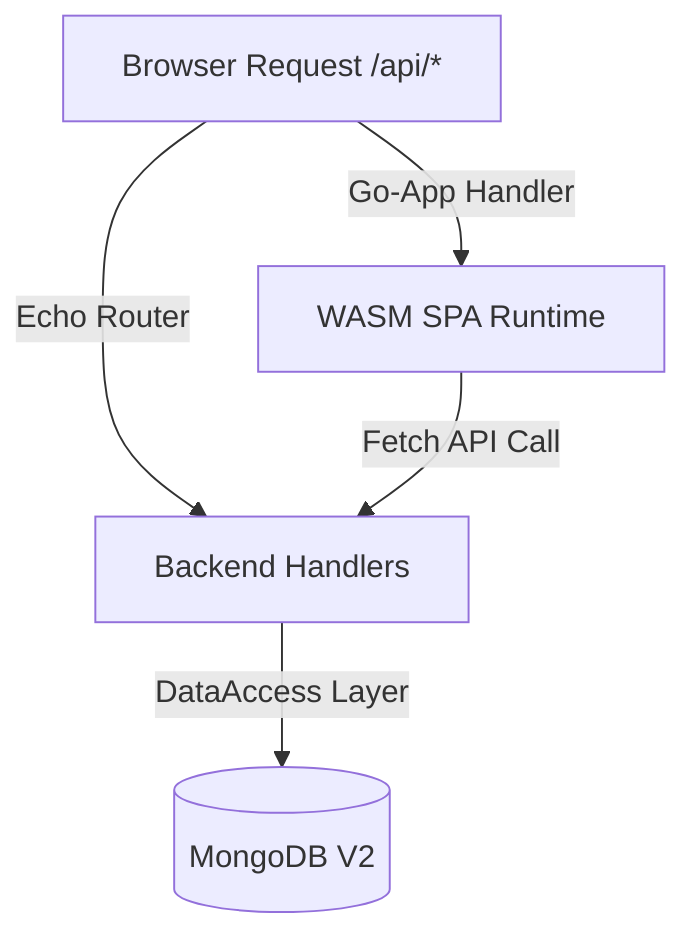

# Traefik Auth Manager

**Traefik Auth Manager** is a lightweight, self-contained application designed to manage credentials, forward authentication authorizations, and secure tokens for Traefik ingress routers. 

It implements a **dual-build Go architecture** that compiles a single unified codebase into:
1. A native Go API backend server.
2. A high-performance, responsive Progressive Web App (PWA) compiled to WebAssembly (WASM).

## 🌟 Key Features

- **Dual-Target Go Compilation**: Write once, run everywhere (Native Backend + WebAssembly Frontend).
- **Type-Safe Full Stack**: Unified models shared between backend and frontend over the network boundary.
- **Progressive Web App (PWA)**: Installable, reactive UI powered by Go.
- **OIDC Integration**: Robust authentication utilizing OpenID Connect and OAuth2.
- **Deep Observability**: Out-of-the-box OpenTelemetry (OTel) tracing for HTTP routes and database operations.

## 🏗️ Architecture & Tech Stack

- **Core**: Go 1.25.0+
- **Backend API**: [Echo Framework (v4)](https://echo.labstack.com/) for routing, CORS, and request handling.
- **Frontend PWA**: [go-app (v10)](https://go-app.dev/) for WebAssembly-based reactive UI components.
- **Database**: MongoDB (via official Go Driver v2).
- **Styling**: Bootstrap v5.
- **Telemetry**: OpenTelemetry (OTel) exporting via OTLP/gRPC.
- **Configuration**: Viper (YAML + Environment Variables).



## 📁 Project Structure

- `cmd/webapp/`: Main entry points.
  - `main.go`: Central executor.
  - `frontend-entry.go`: WASM PWA bindings (`//go:build wasm`).
  - `backend-entry.go`: Native Echo backend server (`//go:build !wasm`).
- `internal/`: Core application logic.
  - `auth/`: OIDC, session, and redirection handling.
  - `components/`: Reusable WASM UI components.
  - `db/`: Data access layer and MongoDB repositories.
  - `handlers/`: Backend API routes.
  - `models/`: Shared data models (JSON/BSON tags).
  - `pages/`: Full UI page layouts.
- `web/`: Static assets, CSS, and JS libraries.
- `scripts/`: Development and build scripts.

## 🛠️ Development Workflow

All build and execution commands are managed via the `Makefile`. Output is placed in the `./tmp` directory.

### Prerequisites
- Go 1.25.0+
- Make
- [wgo](https://github.com/bokwoon95/wgo) (optional, for live reload)

### Build
Builds both the WebAssembly bundle and the local server binary:
```bash
make build
```

### Run Locally
Compiles the project and launches the local backend server:
```bash
make run
```

### Live Reload (Recommended for Dev)
Watches for file changes (`.go`, `.css`, `.js`) and automatically rebuilds and restarts the server:
```bash
# Install wgo first if you haven't: go install github.com/bokwoon95/wgo@latest
wgo -xdir tmp -file .go -file .css -file .js make run
```

### Clean Workspace
```bash
make clean
```

## 🐳 Docker Deployment

To build a production-ready container image:

```powershell
# Windows PowerShell
$env:DOCKER_BUILDKIT=1; docker build . --network=host --tag apogee-dev/traefik-auth-manager:local

# Bash / Zsh
DOCKER_BUILDKIT=1 docker build . --network=host --tag apogee-dev/traefik-auth-manager:local
```

### Running Python Auxiliary Scripts
If you need to run Python scripts (e.g., for resizing service icons in `scripts/`) but don't have Python installed locally, use Docker:

```bash
docker run -d --name python-runner -w /app --entrypoint tail python:3.9-slim -f /dev/null
docker cp ./scripts/your_script.py python-runner:/app/
docker exec python-runner python your_script.py
docker rm -f python-runner
```
